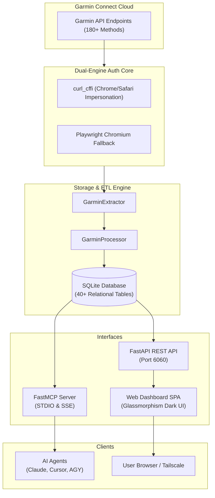

<div align="center">

# ⚡ GarminSynapse

**Unified Health Engine, Relational Database, Native MCP Server & Web Dashboard for Garmin Connect.**

[](https://www.python.org/)
[](https://fastapi.tiangolo.com/)
[](https://modelcontextprotocol.io/)
[](LICENSE)
[](https://github.com/psf/black)

*Bridge your Garmin training data, health metrics, and raw `.FIT` files directly to AI Agents (Claude, Cursor, AGY) and modern web clients.*

[Features](#-key-features) • [Architecture](#-system-architecture) • [Quick Start](#-quick-start) • [MCP Guide](#-mcp-integration-guide) • [REST API](#-rest-api-endpoints) • [License](#-license)

</div>

---

## 🌟 Key Features

<table>
  <tr>
    <td width="50%">
      <h3>🛡️ Dual-Engine Authentication</h3>
      <p>Fast 5-stage <code>curl_cffi</code> browser TLS impersonation with automatic Playwright Chromium fallback for Cloudflare Turnstile CAPTCHA.</p>
    </td>
    <td width="50%">
      <h3>🤖 Native MCP Server Protocol</h3>
      <p>Exposes 10 rich MCP tools allowing AI Assistants to query biometrics, analyze workouts, download <code>.FIT</code> files, and run SQL queries.</p>
    </td>
  </tr>
  <tr>
    <td width="50%">
      <h3>🗄️ Relational SQLite Storage</h3>
      <p>40+ normalized tables for Daily Health Stats, Sleep Stages, RHR, Stress, Body Battery, HRV Baseline, SpO2, and Activities.</p>
    </td>
    <td width="50%">
      <h3>🌐 Glassmorphism Web Dashboard</h3>
      <p>Responsive SPA UI on <b>port 6060</b> featuring health gauges, interactive workout feeds, and authentic login modal.</p>
    </td>
  </tr>
</table>

---

## 🏗️ System Architecture



---

## ⚡ Quick Start

> [!TIP]
> **Zero-Friction Install**: `install.sh` automatically installs all dependencies, Playwright browser binaries, and sets up project directories.

```bash
# 1. Clone Repository
git clone https://github.com/kaivyy/garminsynapse.git
cd garminsynapse

# 2. One-Click Setup
./install.sh

# 3. Start Web Dashboard (Port 6060)
python3 -m garminsynapse.cli start-server --port 6060
```

Open your browser at `http://localhost:6060` or via Tailscale IP `http://<IP-Tailscale-Server>:6060`.

---

## 🤖 MCP Integration Guide

Connect **GarminSynapse** to your favorite AI Assistant in seconds.

### Claude Desktop Setup
Add the following to your `claude_desktop_config.json`:

```json
{
  "mcpServers": {
    "garminsynapse": {
      "command": "python3",
      "args": ["-m", "garminsynapse.cli", "mcp"],
      "env": {
        "PYTHONPATH": "${workspaceFolder}/src"
      }
    }
  }
}
```

### Cursor & AGY Setup
In **Editor Settings** -> **Model Context Protocol (MCP)** -> **Add New Command**:
* **Name**: `garminsynapse`
* **Command**: `python3 -m garminsynapse.cli mcp`

---

## 🛠️ MCP Tools Reference

| Tool Name | Parameters | Description |
|---|---|---|
| `garmin_status` | None | Check auth, database, and MCP status |
| `garmin_login` | `email`, `password` | Authenticate with Garmin Connect |
| `garmin_sync` | `days` (default 7) | Extract recent Garmin metrics to SQLite |
| `get_daily_summary` | `date_str` (`YYYY-MM-DD`) | Get daily steps, RHR, stress, body battery |
| `get_sleep_analysis` | `date_str` (`YYYY-MM-DD`) | Get sleep stages, sleep score, SpO2 |
| `get_hrv_trends` | `date_str` | Get HRV status and weekly baseline |
| `list_activities` | `limit` (default 20) | List recent workouts (distance, duration, HR, calories) |
| `get_activity_details` | `activity_id` | Get detailed time-series metrics & map polyline |
| `download_fit_file` | `activity_id` | Download raw binary `.FIT` file to local storage |
| `query_garmin_db` | `sql_query` | Execute safe `SELECT` query on SQLite DB (40+ tables) |

---

## 📡 REST API Endpoints (Port 6060)

| Method | Endpoint | Description |
|---|---|---|
| `GET` | `/api/v1/status` | System health & authentication status |
| `POST` | `/api/v1/auth/login` | Authenticate Garmin Connect account |
| `POST` | `/api/v1/auth/logout` | Clear active token session |
| `GET` | `/api/v1/summary` | Today's health gauges (Steps, HR, Sleep, Battery) |
| `GET` | `/api/v1/activities` | List recent logged workouts |
| `POST` | `/api/v1/sync` | Trigger manual data extraction |

---

## 🧹 Database Maintenance

> [!NOTE]
> Keep disk usage optimal by downsampling high-frequency 1-second metrics.

```bash
# Downsample raw 1-second time-series metrics older than 30 days
python3 -m garminsynapse.cli downsample --days-keep-raw 30

# Prune historical activities older than 1 year
python3 -m garminsynapse.cli prune --days-keep 365
```

---

## 📄 License

This project is licensed under the MIT License - see the [LICENSE](LICENSE) file for details.
