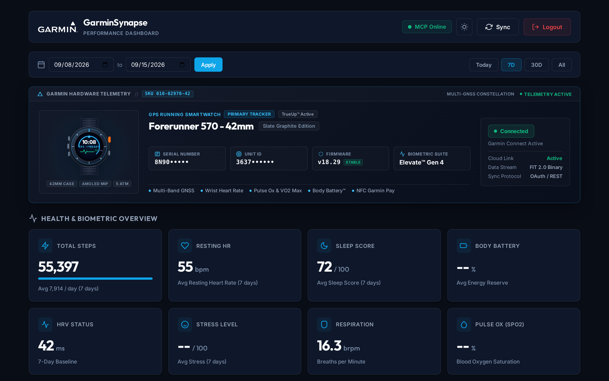
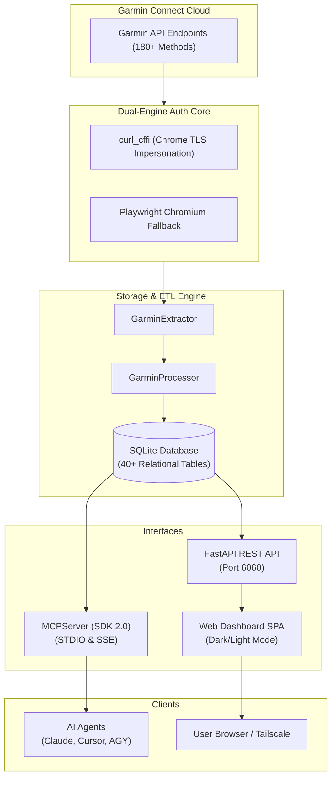

<p align="center">
  
</p>

<div align="center">

# ⚡ GarminSynapse

**Unified Health Engine, Relational Database, Native MCP Server & Web Dashboard for Garmin Connect.**

[](https://www.python.org/)
[](https://fastapi.tiangolo.com/)
[](https://modelcontextprotocol.io/)
[](https://www.sqlite.org/)
[](LICENSE)
[](https://github.com/psf/black)

*Bridge your Garmin training data, health metrics, and raw `.FIT` files directly to AI Agents (Claude, Cursor, AGY) and modern web clients.*

[Features](#-key-features) • [Architecture](#-system-architecture) • [Quick Start](#-quick-start) • [MCP Guide](#-mcp-integration-guide) • [REST API](#-rest-api-endpoints) • [License](#-license)

</div>

---

## 🌟 Key Features

<table>
  <tr>
    <td width="50%">
      <h3>🛡️ Dual-Engine Authentication</h3>
      <p>Fast 5-stage <code>curl_cffi</code> browser TLS impersonation (~1–2s) with automatic Playwright Chromium fallback (~7–10s) for Cloudflare Turnstile CAPTCHA. Tokens cached securely with <code>0600</code> permissions.</p>
    </td>
    <td width="50%">
      <h3>🤖 Native MCP Server (SDK 2.0)</h3>
      <p>Exposes 10 rich MCP tools via <code>MCPServer</code> (MCP SDK v2.0) allowing AI Assistants to query biometrics, analyze workouts, download <code>.FIT</code> files, and run SQL queries.</p>
    </td>
  </tr>
  <tr>
    <td width="50%">
      <h3>🗄️ Relational SQLite Storage</h3>
      <p>40+ normalized tables with <code>UniqueConstraint</code> upsert protection for Daily Health Stats, Sleep Stages, RHR, Stress, Body Battery, HRV Baseline, SpO2, and Activities.</p>
    </td>
    <td width="50%">
      <h3>🌐 Sporty Modern Web Dashboard</h3>
      <p>Responsive SPA on <b>port 6060</b> with 🌗 Dark/Light toggle, Garmin branding, glassmorphism cards, health gauges, interactive workout feeds, and custom date range picker.</p>
    </td>
  </tr>
</table>

---

## 🏗️ System Architecture



---

## ⚡ Quick Start

> [!TIP]
> **Zero-Friction Install**: `install.sh` automatically checks & installs **all** prerequisites (Python ≥ 3.9, pip, git, system libs, Playwright browser, all 13 Python packages). Users never need to install anything manually.

### Prerequisites (auto-handled by `install.sh`)

| Requirement | Version | Notes |
|---|---|---|
| Python | ≥ 3.9 | Script checks and errors if missing |
| pip | Any | Auto-installed via apt/dnf/pacman/brew |
| git | Any | Auto-installed if missing |
| System libs | libnss3, libgbm1, etc. | Auto-installed for Playwright on Debian/Ubuntu |

### Installation

```bash
# 1. Clone Repository
git clone https://github.com/kaivyy/garminsynapse.git
cd garminsynapse

# 2. One-Click Setup (checks & installs everything)
chmod +x install.sh
./install.sh

# 3. Start Web Dashboard (Port 6060)
garminsynapse start-server
# or: python3 -m garminsynapse.cli start-server
```

Open your browser at `http://localhost:6060` or via Tailscale IP `http://<IP-Tailscale-Server>:6060`.

### What `install.sh` does

1. ✅ Checks Python ≥ 3.9, pip, git — auto-installs if missing
2. ✅ Installs system libraries for Playwright (Debian/Ubuntu)
3. ✅ Runs `pip install -e .[dev]` (all 13 dependencies from `pyproject.toml`)
4. ✅ Installs Playwright Chromium browser binary
5. ✅ Creates `garmin_files/` working directories and `~/.garminsynapse/` config
6. ✅ **Validates installation** by importing all modules and testing the web server

> [!NOTE]
> No `requirements.txt` needed — all dependencies are declared in [`pyproject.toml`](pyproject.toml) using modern PEP 621 standards.

---

## 📦 Dependencies

All installed automatically via `pyproject.toml`:

| Package | Purpose |
|---|---|
| `fastapi` + `uvicorn` | REST API server & web dashboard |
| `click` | CLI interface (`garminsynapse` command) |
| `sqlalchemy` | SQLite ORM with 40+ table schema |
| `curl_cffi` | Primary auth via Chrome TLS fingerprint |
| `playwright` | Fallback auth via headless Chromium |
| `garminconnect` | Garmin Connect API client wrapper |
| `mcp` (v2.0) | Model Context Protocol server SDK |
| `fitdecode` | Binary `.FIT` file parser |
| `defusedxml` | Safe XML/TCX parsing |
| `requests` | HTTP utilities |
| `pydantic` | Data validation (via FastAPI) |
| `pytest` | Test suite (dev dependency) |

---

## 🤖 MCP Integration Guide

Connect **GarminSynapse** to your favorite AI Assistant in seconds.

### Claude Desktop Setup
Add the following to your `claude_desktop_config.json`:

```json
{
  "mcpServers": {
    "garminsynapse": {
      "command": "python3",
      "args": ["-m", "garminsynapse.cli", "mcp"],
      "env": {
        "PYTHONPATH": "${workspaceFolder}/src"
      }
    }
  }
}
```

### Cursor & AGY Setup
In **Editor Settings** -> **Model Context Protocol (MCP)** -> **Add New Command**:
* **Name**: `garminsynapse`
* **Command**: `python3 -m garminsynapse.cli mcp`

---

## 🛠️ MCP Tools Reference (20 Native AI Tools)

| Tool Name | Parameters | Description |
|---|---|---|
| `garmin_status` | None | Check auth, database, and MCP system status |
| `garmin_login` | `email`, `password` | Authenticate with Garmin Connect |
| `get_garmin_devices` | None | Get registered watch model names, serial numbers, unit IDs, and firmware |
| `get_live_metrics` | None | Get live point-in-time metrics (Body Battery %, charged/drained, Stress, Steps, Nap) |
| `garmin_sync` | `days` (default 7) | Extract recent Garmin metrics to SQLite database |
| `get_daily_summary` | `date_str` (`YYYY-MM-DD`) | Get daily steps, RHR, stress, body battery, calories, distance |
| `get_sleep_analysis` | `date_str` (`YYYY-MM-DD`) | Get sleep stages, sleep score, and daytime nap intervals |
| `get_training_readiness` | `date_str` (optional) | Get Training Readiness score (0–100) and recovery factors |
| `get_race_predictions` | None | Get race time predictions for 5K, 10K, Half Marathon, and Marathon |
| `get_earned_badges` | None | Get user's earned Garmin Connect achievement badges |
| `get_hrv_trends` | `date_str` (optional) | Get HRV status, weekly baseline, and nightly averages |
| `get_respiration_data` | `date_str` (optional) | Get waking and sleep respiration rates (brpm) |
| `get_spo2_data` | `date_str` (optional) | Get blood oxygen saturation (SpO2 / Pulse Ox %) daily time-series |
| `get_hydration_data` | `date_str` (optional) | Get daily water intake and hydration logs |
| `get_fitness_age` | None | Get calculated Fitness Age vs chronological age |
| `get_user_profile` | None | Get user social and biometric profile (weight, height, gender, VO2 Max) |
| `list_activities` | `limit` (default 20) | List recent workouts (distance, duration, HR, calories) |
| `get_activity_details` | `activity_id` | Get detailed time-series metrics & map polyline |
| `download_fit_file` | `activity_id` | Download raw binary `.FIT` file to local storage |
| `query_garmin_db` | `sql_query` | Execute safe `SELECT` query on SQLite DB (40+ tables) |

---

## 📡 REST API Endpoints (Port 6060)

| Method | Endpoint | Description |
|---|---|---|
| `GET` | `/api/v1/status` | System health & authentication status |
| `POST` | `/api/v1/auth/login` | Authenticate Garmin Connect account |
| `POST` | `/api/v1/auth/logout` | Clear active token session |
| `GET` | `/api/v1/devices` | Connected Garmin watch info with 6-hour cache |
| `GET` | `/api/v1/live` | Live real-time biometric readings (Body Battery, Stress, Steps, Nap) |
| `GET` | `/api/v1/summary` | Health gauges (Steps, HR, Sleep, Battery, HRV, SpO2, Respiration) |
| `GET` | `/api/v1/readiness` | Training Readiness score & recovery factor breakdown |
| `GET` | `/api/v1/predictions` | Race time predictions (5K, 10K, Half Marathon, Marathon) |
| `GET` | `/api/v1/badges` | User's earned Garmin Connect achievement badges |
| `GET` | `/api/v1/profile` | User social profile & biometric parameters |
| `GET` | `/api/v1/activities` | List recent logged workouts with date filters |
| `GET` | `/api/v1/activity/{id}` | Single activity full details |
| `POST` | `/api/v1/sync` | Trigger manual data extraction (with 5-minute cooldown) |

---

## 🖥️ CLI Commands

```bash
# Start web dashboard
garminsynapse start-server [--host 0.0.0.0] [--port 6060]

# Sync Garmin data
garminsynapse sync --email you@mail.com --password yourpass [--days 7]

# Start MCP server (for AI agents)
garminsynapse mcp

# Downsample raw 1-second time-series metrics older than 30 days
garminsynapse downsample --days-keep-raw 30

# Prune historical activities older than 1 year
garminsynapse prune --days-keep 365
```

---

## 🧹 Database Maintenance

> [!NOTE]
> Keep disk usage optimal by downsampling high-frequency 1-second metrics.

```bash
# Downsample raw 1-second time-series metrics older than 30 days
garminsynapse downsample --days-keep-raw 30

# Prune historical activities older than 1 year
garminsynapse prune --days-keep 365
```

---

## 🧪 Running Tests

```bash
# Run full test suite
PYTHONPATH=src pytest tests/ -v

# Run specific module tests
PYTHONPATH=src pytest tests/test_db.py -v
PYTHONPATH=src pytest tests/test_mcp.py -v
```

---

## 📄 License

This project is licensed under the MIT License - see the [LICENSE](LICENSE) file for details.
