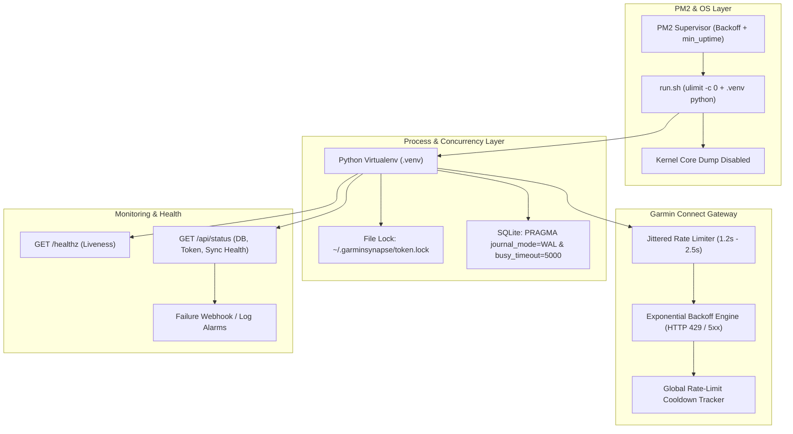

# GarminSynapse - Architecture Resilience & Enhancement Specification

**Date**: 2026-09-26  
**Document ID**: `SPEC-2026-09-26-RESILIENCE`  
**Status**: Proposed / Ready for Review  
**Target Component**: `garminsynapse` (Process Runtime, Auth, Core API, ETL, Database, Web Monitoring)

---

## 1. Executive Summary & Context

### 1.1 Incident Post-Mortem Context
On 2026-09-26, a cascading failure took down `hermes` and exhausted system disk storage to 100% (490GB+). 
The chain of events was:
1. **OS-Level Corruption**: An unreadable disk block on `/lib/x86_64-linux-gnu/libz.so.1.3.1` raised `SIGBUS (BUS_ADRERR)` whenever Python loaded compiled C/Cython extensions (SQLAlchemy / CFFI).
2. **PM2 Tight Restart Loop**: In `ecosystem.config.cjs`, `garminsynapse` was managed with no restart delay (`restart_delay: 0`), triggering 25–30 process restarts per minute.
3. **Core Dump Flooding**: Each native `SIGBUS` crash dumped ~60MB of process core memory to `/root/garminsynapse/core.<PID>`. Within hours, 1,661 core files generated over 78GB of unmanaged disk data, completely filling the root partition.
4. **Hermes Database Failure**: The resulting disk exhaustion caused Hermes' SQLite database to fail with `SQLITE_IOERR` (`disk I/O error`), terminating the bot and dashboard.

### 1.2 Objective
This specification outlines comprehensive enhancements to prevent recursive crash storms, protect against disk exhaustion, eliminate API rate-limiting penalties from Garmin WAF, enforce cross-process concurrency safety, and provide continuous observability.

---

## 2. Problem Statements & Technical Gaps

| Area | Current Behavior | Failure Mode / Risk |
| :--- | :--- | :--- |
| **Runtime Isolation** | `ecosystem.config.cjs` invokes `/usr/bin/python3` directly instead of project `.venv`. | Contamination from OS library upgrades; vulnerability to system package breakages. |
| **Crash Safety** | Process crashes produce unrestricted `core.<PID>` dumps; PM2 restarts immediately without backoff. | Storage explosion (GBs/hr) during repeating C-extension crashes; disk exhaustion for neighbor apps. |
| **API Pacing** | `extractor.py` queries 12 endpoints per day with `time.sleep(0.3)`. | 7-day sync fires 84+ requests in 20s, triggering Cloudflare/Akamai `429 Too Many Requests` / IP bans. |
| **Retry Logic** | `with_auto_retry` has no exponential backoff, jitter, or cooldown tracking for 429/5xx errors. | Retry storm worsens Garmin WAF rate limits; retries happen immediately without cooldown. |
| **Token Locking** | In-memory `threading.Lock()` in `AuthManager`. | Concurrent CLI commands (`garminsynapse sync`) vs background PM2 service corrupt `tokens.json`. |
| **SQLite Concurrency** | Default SQLite configuration without explicit WAL or busy timeout settings. | `sqlite3.OperationalError: database is locked` when web dashboard queries while ETL batch-writes. |
| **Observability** | No unauthenticated `/healthz` or status endpoint; silent background sync failures. | Silent data synchronization halts; external monitoring cannot detect token expiration or sync hangs. |

---

## 3. Architecture & Enhancement Design



---

## 4. Detailed Specification by Component

### 4.1 Component 1: Process Hardening & Crash Defense

#### 4.1.1 Core Dump Suppression (`run.sh`)
Create an entrypoint runner script `/root/garminsynapse/run.sh`:
```bash
#!/usr/bin/env bash
set -e

# Disable core dump generation to prevent disk exhaustion
ulimit -c 0

# Enforce isolated virtualenv Python
VENV_DIR="/root/garminsynapse/.venv"
if [ ! -d "$VENV_DIR" ]; then
    echo "ERROR: Virtualenv not found at $VENV_DIR" >&2
    exit 1
fi

export PATH="$VENV_DIR/bin:$PATH"
exec "$VENV_DIR/bin/python" -m garminsynapse.web.app "$@"
```

#### 4.1.2 PM2 Ecosystem Configuration (`ecosystem.config.cjs`)
Update `/root/garminsynapse/ecosystem.config.cjs`:
```javascript
module.exports = {
  apps: [{
    name: 'garminsynapse',
    script: './run.sh',
    cwd: '/root/garminsynapse',
    interpreter: 'none',
    max_memory_restart: '500M',
    // Crash storm protection:
    restart_delay: 5000,
    exp_backoff_restart_delay: 2000,
    max_restarts: 15,
    min_uptime: '20s',
    kill_timeout: 5000,
    env: {
      PYTHONUNBUFFERED: '1',
      GARMIN_DATA_DIR: '/root/garminsynapse',
      NODE_ENV: 'production'
    },
    error_file: '/root/.pm2/logs/garminsynapse-error.log',
    out_file: '/root/.pm2/logs/garminsynapse-out.log',
    merge_logs: true
  }]
};
```

---

### 4.2 Component 2: API Rate-Limiting & Exponential Backoff

#### 4.2.1 Global Rate-Limit & Cooldown State
Create `src/garminsynapse/core/throttler.py`:
- Track `_rate_limited_until: Optional[datetime] = None`.
- If an HTTP 429 response is received:
  - Read `Retry-After` header (if available, otherwise fallback to exponential duration: 60s, 120s, 300s).
  - Set `_rate_limited_until = utcnow() + delay`.
  - Block subsequent outgoing requests until the cooldown window expires, returning early with a clear warning log instead of repeatedly bombarding the Garmin WAF.

#### 4.2.2 Pacing in ETL Extractor (`src/garminsynapse/etl/extractor.py`)
Replace the static `time.sleep(0.3)` in `extract_all`:
```python
import random
import time

def _adaptive_sleep(min_s: float = 1.0, max_s: float = 2.2):
    """Paces requests with jitter to emulate organic client traffic."""
    delay = random.uniform(min_s, max_s)
    time.sleep(delay)
```
- Endpoint-to-endpoint delay: `1.0s – 2.0s` jittered.
- Day-to-day delay: `2.5s – 4.5s` jittered.
- If a 429 occurs, interrupt the daily batch, record the state, and resume during the next scheduled cycle.

#### 4.2.3 Decorator `with_auto_retry` Enhancement (`src/garminsynapse/core/api.py`)
Enhance retry handling:
```python
def with_auto_retry(max_retries: int = 3, base_delay: float = 2.0, max_delay: float = 30.0):
    def decorator(func):
        @functools.wraps(func)
        def wrapper(*args, **kwargs):
            last_exc = None
            for attempt in range(max_retries):
                Throttler.ensure_not_rate_limited()
                try:
                    return func(*args, **kwargs)
                except GarminRateLimitError as e:
                    Throttler.mark_rate_limited(e.retry_after or (60 * (attempt + 1)))
                    raise
                except (GarminNetworkError, GarminServerError) as e:
                    last_exc = e
                    delay = min(max_delay, base_delay * (2 ** attempt)) + random.uniform(0.5, 1.5)
                    time.sleep(delay)
            raise last_exc
        return wrapper
    return decorator
```

---

### 4.3 Component 3: Cross-Process Concurrency Safety

#### 4.3.1 File-Based Token Locking (`src/garminsynapse/auth/manager.py`)
Use advisory file locking around token read/write/refresh operations:
```python
import fcntl
from contextlib import contextmanager

@contextmanager
def file_lock(lock_path: Path, timeout: float = 10.0):
    lock_file = open(lock_path, "w")
    try:
        fcntl.flock(lock_file.fileno(), fcntl.LOCK_EX)
        yield
    finally:
        fcntl.flock(lock_file.fileno(), fcntl.LOCK_UN)
        lock_file.close()
```
- Applied around `AuthManager.login()`, `AuthManager.refresh_tokens()`, and token serialization.
- Prevents race conditions between FastAPI web server and manual terminal CLI executions (`garminsynapse sync`).

#### 4.3.2 SQLite WAL & Concurrency Configuration (`src/garminsynapse/db/session.py`)
Enforce high-concurrency PRAGMAs on every SQLite engine connection:
```python
from sqlalchemy import event
from sqlalchemy.engine import Engine

@event.listens_for(Engine, "connect")
def set_sqlite_pragma(dbapi_connection, connection_record):
    cursor = dbapi_connection.cursor()
    cursor.execute("PRAGMA journal_mode = WAL")
    cursor.execute("PRAGMA busy_timeout = 5000")
    cursor.execute("PRAGMA synchronous = NORMAL")
    cursor.close()
```
- `journal_mode = WAL`: Allows concurrent readers and single writer without blocking.
- `busy_timeout = 5000`: Retries busy locks for up to 5 seconds before raising `sqlite3.OperationalError`.

---

### 4.4 Component 4: Observability & Health Monitoring

#### 4.4.1 Health & Diagnostic Endpoints (`src/garminsynapse/web/app.py`)
Add two lightweight endpoints:

1. **`GET /healthz`** (Lightweight probe for PM2 / Docker / Monit / Uptime Kuma):
   - Fast, returns `200 OK` `{"status": "ok"}`.
   - Verifies process is alive and event loop is responsive.

2. **`GET /api/status`** (Comprehensive diagnostic status):
   ```json
   {
     "status": "healthy",
     "timestamp": "2026-09-26T13:15:00Z",
     "runtime": {
       "uptime_seconds": 3600,
       "pid": 639290,
       "python_interpreter": "/root/garminsynapse/.venv/bin/python"
     },
     "database": {
       "status": "connected",
       "size_bytes": 90112,
       "journal_mode": "wal"
     },
     "auth": {
       "authenticated": true,
       "token_valid": true,
       "token_expires_at": "2026-10-01T00:00:00Z",
       "rate_limited": false
     },
     "sync": {
       "last_successful_sync": "2026-09-26T07:09:12Z",
       "consecutive_failures": 0
     }
   }
   ```

#### 4.4.2 Failure Alerting Hook
Track consecutive sync errors in `SyncManager`:
- If `consecutive_failures >= 3`:
  - Log an `[ALERT]` severity event.
  - Optionally trigger a webhook (Telegram / Discord / Hermes internal bus).
  - Surface visual warning banner in the SPA Dashboard.

---

## 5. Verification & Testing Matrix

| Test ID | Objective | Verification Method | Expected Result |
| :--- | :--- | :--- | :--- |
| **TEST-01** | Virtualenv enforcement | Run `./run.sh` and inspect `sys.executable`. | Points strictly to `.venv/bin/python`. |
| **TEST-02** | Core dump suppression | Trigger `kill -SEGV <PID>` on a test process running under `ulimit -c 0`. | Zero `core.<PID>` files generated. |
| **TEST-03** | PM2 exponential backoff | Trigger simulated failures in PM2 test app. | Restart intervals back off (5s, 7s, 11s...) up to `max_restarts`. |
| **TEST-04** | Rate limiter & jitter | Execute `extract_all` for a 3-day test range. | Request intervals observe 1.0s–2.0s random distribution. |
| **TEST-05** | Cross-process lock | Concurrently execute two instances of token refresh. | Secondary process waits cleanly for lock release without corrupting token file. |
| **TEST-06** | SQLite WAL concurrency | Run heavy ETL write loop while concurrently querying `/api/v1/metrics`. | No `database is locked` errors; both queries succeed. |
| **TEST-07** | Health endpoints | Send `GET /healthz` and `GET /api/status`. | `200 OK` with JSON telemetry. |
